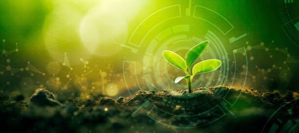
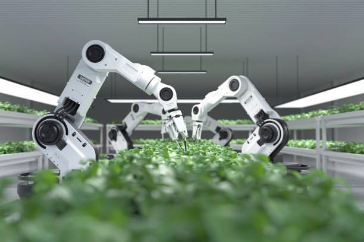
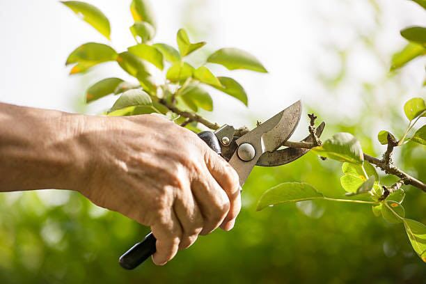
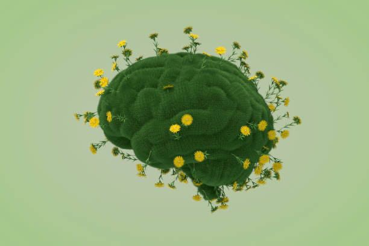
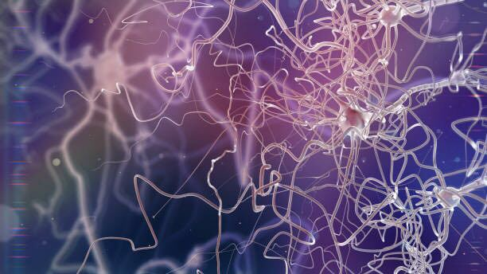

  

# Følende planter?

 Del: <a href="https://www.facebook.com/sharer/sharer.php?u=https://xn--harplanterflelser-b1b.dk/" target="_blank" class="social-button facebook">
    <i class="fab fa-facebook-f"></i> 
    
  </a>
  <a href="https://twitter.com/intent/tweet?urlhttps://xn--harplanterflelser-b1b.dk/&text=Check+this+out!" target="_blank" class="social-button twitter">
    <i class="fa-solid fa-x"></i> 
  </a>
  <a href="https://www.linkedin.com/sharing/share-offsite/?url=https://xn--harplanterflelser-b1b.dk/" target="_blank" class="social-button linkedin">
    <i class="fab fa-linkedin-in"></i> 
  </a>

 Skrevet af foreningen: Etik og planter 

Bevidsthed er i sin mest grundlæggende form evnen til at have subjektive oplevelser. Med andre ord er bevidstheden det, der gør os i stand til at føle, tænke og være opmærksomme på os selv, vores omgivelser, og relationen imellem disse. Når vi taler om bevidsthed, taler vi om evnen til at være bevidst om noget - for eksempel at være opmærksom på eksterne sanseindtryk, såsom lyde og lys, eller interne sansefænomener, såsom tanker og emotioner. Selv om bevidsthed inkluderer at kunne observere sine omgivelser og reagere på stimulus, indebærer det mere end blot automatiske reaktioner. For eksempel er en automatisk skydedør ikke bevidst, blot fordi at den registrerer, når en person nærmer sig. Bevidsthed er et komplekst fænomen, som ikke blot omhandler adfærd, men også grader af subjektivitet, opmærksomhed og evnen til at reflektere over egne oplevelser og handlinger.
Selvom man ikke behøver at diskutere, hvorvidt en sensor til en skydedør er bevidst eller ej, kan spørgsmålet gøre én nysgerrig omkring, hvad det egentlig er, der gør bevidsthed muligt. For at forstå bevidsthed, skal vi først se på, hvad forskere mener er nødvendigt for, at det kan opstå:

### Forudsætninger for bevidsthed
Et centraliseret nervesystem: Bevidsthed kræver en kompleks struktur til at bearbejde og integrere information. Hos dyr, herunder mennesker, er dette system hjernen og det centrale nervesystem. Hjernen samler sanseinformation fra vores omgivelser - som lyde, synsindtryk og berøringer - og bearbejder det til en forståelig helhed. Uden et sådant system ville bevidsthed, som vi kender det, sandsynligvis ikke kunne eksistere. Planter har ingen hjerne eller nervesystem, og det er en af de vigtigste grunde til, at de ikke kan siges at være bevidste.
Integration af information: Bevidsthed kræver, at en organisme kan samle og forbinde forskellige typer information på én gang. For eksempel oplever vi ikke verden som en samling af enkeltdele (lyd, lys, temperatur, etc.), men som en sammenhængende oplevelse. Dette kræver komplekse forbindelser i hjernen, som forbinder og bearbejder sanseindtryk i realtid. Hos planter er der ingen tegn på, at de kan integrere information på denne måde—de reagerer “mekanisk” på forskellige stimuli, men de oplever det ikke som en bevidst helhed.
Opmærksomhed og beslutningstagning: Bevidste væsener kan ikke bare reagere på verden omkring sig; de kan vælge at fokusere på bestemte ting eller træffe valg baseret på deres erfaringer. Denne evne til opmærksomhed og beslutningstagning er afgørende for bevidsthed. Når du for eksempel beslutter dig for at gå udenfor, fokuserer du på bestemte aspekter af dine omgivelser og ignorerer andre. Planter reagerer på deres miljø - som at dreje mod solen som led i deres metaboliske aktivitet - men denne proces sker uden bevidst opmærksomhed eller valg.

### Hvorfor planter ikke opfylder kravene til bevidsthed
Selvom planter har fascinerende evner på det biokemiske og fysiologiske plan, som at reagere på lys, berøring eller endda at kommunikere gennem kemiske signaler, er disse processer automatiske. De er resultatet af evolutionære tilpasninger og sker uden nogen form for subjektiv oplevelse. Planter har ingen hjerne, ingen central informations-integration og ingen evne til at fokusere opmærksomt på deres omgivelser. Selv om de er i stand til at overleve og tilpasse sig, er det ikke ensbetydende med, at de har bevidsthed.
Kort sagt: Bevidsthed kræver et komplekst netværk af neuroner, der kan samle og bearbejde sanseindtryk og skabe en sammenhængende oplevelse af verden. Da planter mangler disse strukturer, er de højst sandsynligt ikke bevidste, selv om de kan udvise imponerende reaktioner på deres miljø.

### Planter “kommunikerer” ikke som dyr
Når vi hører ordet “kommunikation,” tænker vi typisk på samtaler mellem mennesker eller dyr, der udveksler signaler og lyde for at overføre information. Men når forskere siger, at planter "kommunikerer," mener de noget helt andet. Planter udsender kemiske signaler til deres omgivelser som svar på forskellige stimuli, som f.eks. skader eller angreb fra insekter. Denne form for signalering er automatisk og kræver ikke bevidsthed.
For eksempel kan en plante frigive kemikalier i luften for at signalere til andre planter, at den bliver beskadiget, så deres forsvarsmekanismer aktiveres. Men dette er en automatisk biokemisk proces, og ikke en overlagt beslutning, som når vi mennesker bevidst vælger at fortælle noget til en anden person. Faktisk ses denne form for kemisk signalering og “aflytning” også hos bakterier og encellede organismer - og vi ville ikke påstå, at disse er bevidste eller har tanker.
Forestil dig, at du har en røgdetektor i dit hus. Når der opstår røg, sender røgdetektoren et højt alarmsignal, der advarer dig og eventuelt også andre om, at der er fare på færde. Denne envejs "kommunikation" fra røgdetektoren til dig virker som en form for advarsel eller informationsoverførsel, men røgdetektoren er selvfølgelig ikke bevidst om noget som helst. Den udfører blot en automatisk reaktion på røgen, baseret på dens design og formål.
I konteksten af planter er det dog endnu mere simpelt. Her ville modtageren af lydsignalet ikke være sammenlignelig med et menneske, men nærmere en lydoptager, som blot registrerer lyden og transmitterer den videre som et kemisk signal. Ligesom røgdetektoren og lydoptageren, så reagerer planter på kemiske signaler uden nogen form for bevidsthed eller intention. De reagerer automatisk på stimuli i deres omgivelser, og selv om dette kræver simple sanseorganer, indebærer det ikke, at de har en subjektiv oplevelse af situationen eller en følelse af fare.

### Sanseorganer er ikke det samme som bevidsthed
Uden en central struktur til at bearbejde og integrere sanseinformationer, kan vi ikke tale om planten som et subjekt, der oplever eller opfatter noget. I stedet handler det om biomekaniske processer, hvor planter reagerer på deres omgivelser uden nogen form for subjektiv bevidsthed eller opmærksomhed. Med andre ord, det er ikke planten selv, der "ser" lyset - det er blot dens fotoreceptorer, der reagerer på det.
Lignende processer findes også i dyreriget, inklusive hos pattedyr som mennesker, og bruges til at initiere selvbeskyttende adfærd; for eksempel trækker vi hurtigt hånden til os, når vi brænder os på noget varmt. Denne instinktive reaktion kræver dog ikke bevidsthed, men opstår som konsekvens af lokale biokemiske processer i armen. Denne type selvbeskyttende adfærd kan endda aktiveres i afskårne lemmer - og vi ville ikke påstå, at afskårne lemmer er bevidste eller har tanker.

### Smerte er noget, hjernen skaber - ikke blot et signal
Et af de største misforståelser omkring plante-bevidsthed handler om, hvorvidt planter kan føle smerte. Når vi føler smerte, sker det ikke blot fordi vores nerver registrerer skader. Smerte er en kompleks oplevelse, som genereres i hjernen, og som involverer både fysiske og følelsesmæssige aspekter. Mennesker og andre dyrs nerver registrerer skade (kaldet nociception), men smerte er den bevidste oplevelse, der følger af denne registrering, og denne oplevelse bliver genereret i hjernen.
Planter har ingen hjerne, så selv om de kan reagere på skade, som når en gren knækker eller et insekt bider i et blad, kan de ikke føle smerte. De oplever ikke denne skade subjektivt, som mennesker og dyr gør. Det er vigtigt at skelne mellem en simpel, automatisk reaktion og den komplekse, bevidste oplevelse af smerte.

Kort sagt: Planter udviser imponerende adfærd og reaktioner, men det betyder ikke, at de er bevidste. Deres signalering, sansning og reaktion på skade er biologiske processer - men ikke et bevis for en bevidst oplevelse af verden.

## Bevidsthed, hjernen og bevægelse
Bevidsthed er tæt knyttet til evnen til at træffe beslutninger og koordinere komplekse bevægelser. Forskning tyder på, at en af hjernens primære funktioner netop er at koordinere motorfunktioner, altså at kontrollere kroppens bevægelser. Denne evne kræver ikke kun sanseindtryk, men også en central struktur—hjernen—til at bearbejde information og tage beslutninger i realtid. Det er her, vi ser forbindelsen mellem udviklingen af hjernen, kompleks bevægelse, og bevidsthed.
Hos dyr har udviklingen af komplekse nervesystemer, især hjernen, gjort det muligt at styre hurtige og præcise bevægelser. Når et dyr skal flygte fra en trussel eller jage et bytte, kræver det en øjeblikkelig integration af sanseindtryk og motoriske reaktioner. Bevidsthed spiller her en central rolle ved at samle information fra forskellige sanser og koordinere de mest hensigtsmæssige handlinger. Dette kræver en hjerne, der kan analysere og sammenfatte informationen, og det er netop denne integration, der giver grundlag for bevidst oplevelse.
Bevidsthed opstår altså ikke blot som følge af sansning, men også på grund af behovet for at reagere dynamisk i et komplekst miljø. Hjernen udviklede sig som et redskab til at kontrollere denne type bevægelser, og bevidsthed er en af de nødvendige komponenter for at gøre disse reaktioner fleksible og målrettede.

### Planters stationære natur og manglende behov for en hjerne
Planter har derimod ikke behov for at koordinere komplekse bevægelser. De er stationære og har ikke brug for at træffe hurtige beslutninger om at undgå fare eller opsøge mad. Derfor har planter ikke udviklet et nervesystem eller en hjerne til at bearbejde sanseindtryk på samme måde som dyr. Deres reaktioner på stimuli, som f.eks. lys eller vand, er langsomme og automatiske. Dette betyder, at planter ikke behøver en central struktur som hjernen til at integrere sanseinformation og træffe beslutninger.

### Hvorfor planter ikke behøver bevidsthed
Fordi planter er stationære og ikke skal koordinere hurtige, komplekse bevægelser, har de heller ikke haft behov for at udvikle et komplekst nervesystem. Da bevidsthed opstår i sammenhæng med en hjerne, der kan håndtere dynamiske og komplekse situationer, især i forhold til bevægelse, har planter ikke haft nogen evolutionær fordel i at udvikle bevidsthed. Planter lever et liv, hvor langsom tilpasning til miljøet er tilstrækkeligt, og derfor er en avanceret, bevidst bearbejdning af sanseindtryk overflødig.
Kort sagt: Mens bevidsthed hos dyr hænger tæt sammen med behovet for at koordinere bevægelser gennem et komplekst nervesystem og en hjerne, lever planter et stillestående liv, hvor automatiske reaktioner er nok. Derfor har de ikke udviklet bevidsthed.

## Manglende subjektive oplevelser
Bevidsthed er et komplekst fænomen, der kræver et centraliseret nervesystem, evnen til at integrere sanseinformation, samt opmærksomhed og beslutningstagning. Disse funktioner er tæt forbundet med hjernens primære rolle i at koordinere komplekse bevægelser, som vi ser hos dyr. Bevidsthed udviklede sig som en evolutionær nødvendighed for at håndtere dynamiske og komplekse situationer, hvor hurtige beslutninger om bevægelse er afgørende.
Planter, der er stationære og ikke har brug for at træffe øjeblikkelige beslutninger, har hverken nervesystem, hjerne eller bevidsthed. Deres automatiske reaktioner på stimuli er imponerende, men de mangler subjektive oplevelser og evnen til at bearbejde information på et bevidst niveau. Derfor er planter biologisk tilpasset til deres miljø, uden at have behov for en bevidsthed, som vi kender den fra dyr og mennesker.

<!-- 
## Læs mere

  <a href="/page1" class="button">Misforståelser om planter</a>
  <a href="/page2" class="button">Dyr og bevisthed</a>
  <a href="/references" class="button">Referencer</a>

-->
